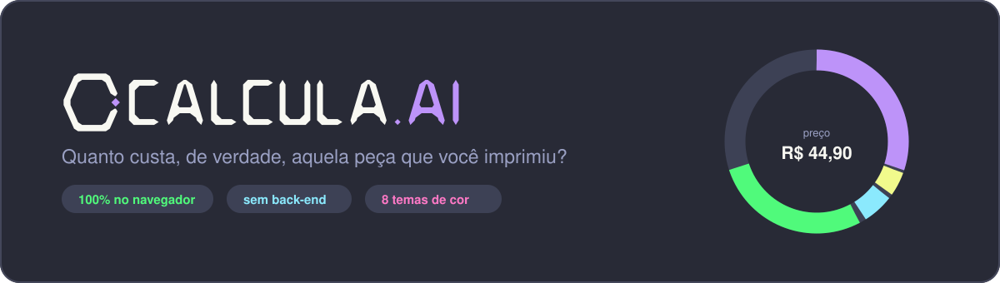

<div align="center">



### Calculadora de custos e precificação para impressão 3D

Descubra quanto realmente custa cada peça — filamento, energia, depreciação da máquina, seu tempo e o risco de falha — e chegue num preço de venda com margem consciente.

[**🔗 Abrir a calculadora**](https://mocelinc.github.io/calcula-ai/)

</div>

---

## 🤖 Sobre o nome

**Calcula.AI** 

O `.AI` não é enfeite: **o projeto inteiro foi construído em parceria com uma IA** — regras de negócio, arquitetura, interface, paletas de cor, correção de bugs e o deploy. A ideia, as decisões de produto e a validação são humanas; a implementação nasceu de uma conversa. O nome é uma piada honesta sobre a própria origem do projeto.

---

## 🎯 O problema

Quem imprime em 3D pra vender costuma precificar no chute — normalmente só o peso do filamento. O que fica de fora:

- ⚡ A **energia** que a impressora consumiu durante 8 horas ligada
- 🖨️ A **depreciação** da máquina: cada hora impressa gasta um pedaço dela
- ⏱️ O **seu tempo** de preparo, remoção de suporte e acabamento
- 💥 As peças que **falharam** e foram pro lixo
- 📦 Embalagem, e o **lucro** que sobra depois de tudo isso

O Calcula.AI junta tudo isso numa tela só, atualizando o preço enquanto você digita.

---

## ✨ Funcionalidades

**Cálculo**
- Preço atualizado em tempo real, sem botão "calcular"
- Peças **multi-material**: várias cores/filamentos na mesma peça, cada um com peso e preço/kg próprios
- Tempo de impressão num campo só — aceita `8,30`, `8:30`, `8` ou `90min`, e confirma na tela: *"= 8h 30min"*
- Markup por slider com **termômetro de margem** (baixa → moderada → saudável → premium)
- **Preço marketeiro**: arredonda pra finais estratégicos de venda (R$ 43,20 → **R$ 44,90**)
- Simulador de quantidade e risco de falha embutido no custo

**Organização**
- Telas separadas para **Impressoras** e **Filamentos**, com cadastro em lista e salvamento automático
- Ajustes fixos (tarifa de energia, valor da sua hora, embalagem) fora do caminho do dia a dia
- Botão **Copiar orçamento**: gera o texto pronto pra colar no WhatsApp do cliente

**Visual**
- Gráfico de rosca + anatomia do custo item a item
- Insight automático: *"com esse lucro, 189 peças como essa pagam sua impressora"*
- **8 paletas de cor**, com seletor visual de amostras:

  🌙 Dracula · Nord · Tokyo Night · Gruvbox · Catppuccin  ☀️ Minimalista · Ocean · Solarized

---

## 🧮 Como o cálculo funciona

```
Filamento     = Σ (peso de cada material ÷ 1000) × preço por kg
Energia       = (watts ÷ 1000) × horas de impressão × tarifa do kWh
Depreciação   = (valor da máquina ÷ vida útil em horas) × horas de impressão
Mão de obra   = (minutos de preparo ÷ 60) × valor da sua hora

Custo base    = Filamento + Energia + Depreciação + Mão de obra + Embalagem + Extras
Custo final   = Custo base × (1 + risco de falha)
Preço         = Custo final × (1 + markup)
```

> Campos sem informação confirmada começam **zerados** — nada de número inventado inflando seu preço. Vida útil em `0`, por exemplo, simplesmente tira a depreciação da conta até você preencher.

---

## 🗂️ Estrutura

```
calcula-ai/
├── index.html          As quatro telas (calculadora, impressoras, filamentos, ajustes)
├── css/
│   ├── themes.css      As 8 paletas, cada uma como um conjunto de variáveis CSS
│   └── style.css       Layout e componentes
├── js/
│   ├── calculator.js   Regras de negócio puras (sem DOM) — todas as fórmulas
│   ├── storage.js      Persistência em localStorage + backup .json
│   ├── theme.js        Catálogo de temas e seletor visual
│   ├── chart.js        Gráfico de rosca (Chart.js)
│   ├── ui.js           Ponte entre DOM e os módulos acima
│   └── main.js         Ponto de entrada
└── docs/banner.svg
```

Sem build, sem framework, sem `node_modules`. A única dependência externa é o **Chart.js**, via CDN.

---

## 🚀 Rodando

Abra o `index.html` no navegador. Só isso.

Se preferir servir localmente (evita restrições de `file://` em alguns navegadores):

```bash
npx serve .
```

**Deploy:** `Settings` → `Pages` → Source **Deploy from a branch** → branch `main`, pasta `/(root)`.

---

## 🔒 Privacidade

Nenhum dado sai do seu navegador. Não há servidor, conta, telemetria ou cookie — tudo vive no `localStorage` da sua máquina. Use **Exportar dados** de vez em quando pra guardar um `.json` de backup, já que limpar o cache do navegador apaga tudo.

---

<div align="center">

Feito para makers que querem parar de vender no prejuízo. 🖨️

</div>
